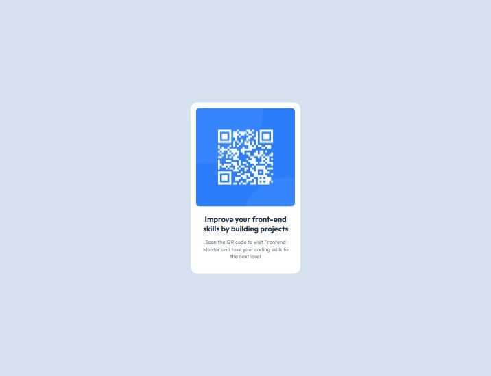

# Frontend Mentor - QR code component solution

This is a solution to the [QR code component challenge on Frontend Mentor](https://www.frontendmentor.io/challenges/qr-code-component-iux_sIO_H). Frontend Mentor challenges help you improve your coding skills by building realistic projects.

## Table of contents

- [Overview](#overview)
  - [Screenshot](#screenshot)
  - [Links](#links)
- [My process](#my-process)
  - [Built with](#built-with)
  - [What I learned](#what-i-learned)
  - [Continued development](#continued-development)
- [Author](#author)
- [Acknowledgments](#acknowledgments)

## Overview

### Screenshot



### Links

- Solution URL: [Add solution URL here](https://github.com/AMfazri/QR-Code-Component.git)
- Live Site URL: [Add live site URL here](https://amfazri.github.io/QR-Code-Component/)

## My process

### Built with

- Semantic HTML5 markup
- Flexbox

### What I learned

- I'm using semantic html like <main> instead of using div.

- I learned to make the good commits such as:
  style: apply spacing and typography
  feat: built main layout structure
  feat: add base html structure
  chore: setup google font "Outfit"
  chore: initialize project

- I'm using flex to make the contents centered fully. this is really helpfull instead of using another method

```css
body {
  display: flex;
  justify-content: center;
  align-items: center;
}
```

### Continued development

in next challange, i want to keep use semantic html5 markup and begin to use css custom properties. i hope using these methods regularly that will make me feel comfort and be a good habitual.

## Author

- Frontend Mentor - [@yourusername](https://www.frontendmentor.io/profile/AMfazri)

## Acknowledgments

thanks to Chat gpt for being my mentor.i never ask for codes but i ask many about basic knowledge and how to use that such as how to make a good commits, how to using flex,what is semantic html and many more. that all really helpfull for me as newbie.
